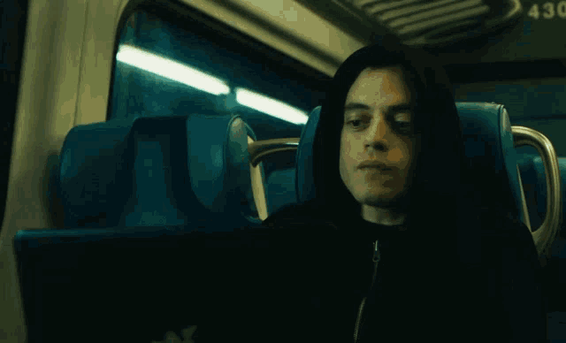

# Welcome to me

  

## About Me
Hi there! I'm Dima, a **C++ & Unreal Engine Developer** with a strong passion for **Cybersecurity** and **Artificial Intelligence**. I focus on building optimized systems, creating immersive virtual worlds, and exploring software vulnerabilities.

- 🛠️ Actively developing in **C++** and blueprinting/coding in **Unreal Engine**
- 🛡️ Researching ethical hacking, reverse engineering, and software security (Cybersecurity)
- 🤖 Integrating **AI/ML** concepts and neural networks into practical workflows
- 💬 Open to international projects, remote roles, and engineering internships!

---

## 🛠️ Tech Stack & Skills

### Core Development & Engines

  
  
  

### Tools & OS

  
  
  
  
  

---

## 🌐 Connect With Me

Feel free to reach out for career opportunities, collaborations, or just a tech chat:

 **Telegram:** [@Reschalka](https://t.me/Reschalka)
 **Email:** [reschalka@gmail.com](mailto:reschalka@gmail.com)
